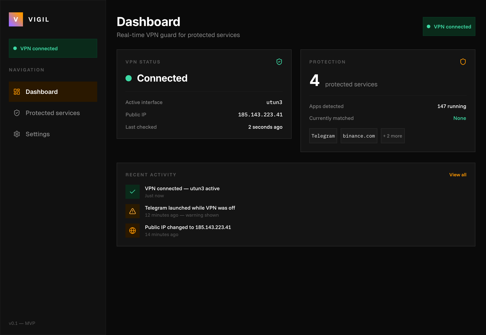
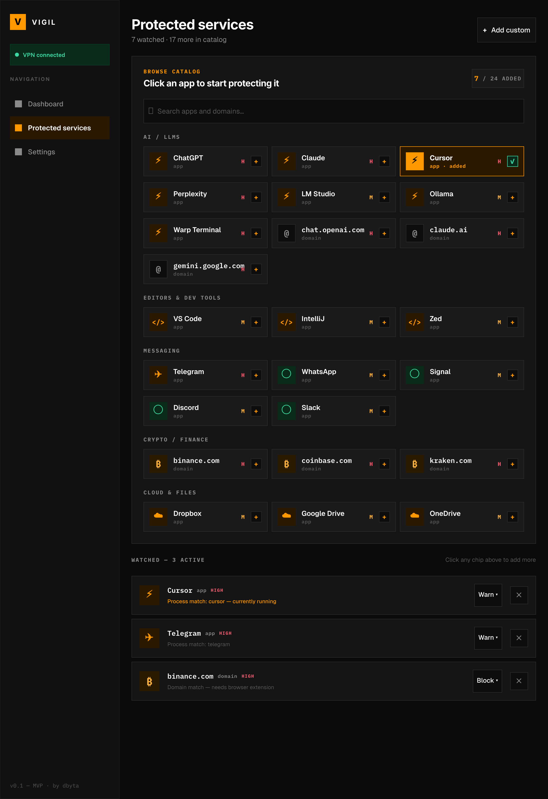
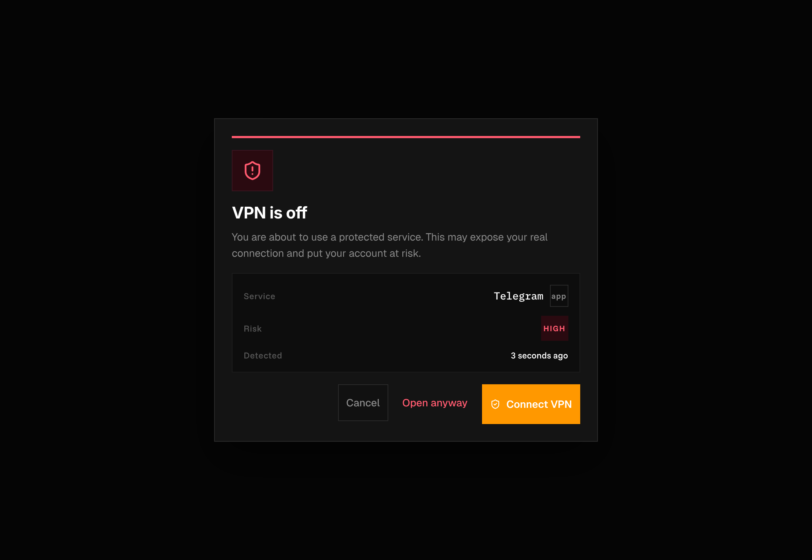

<div align="center">


# VIGIL

**Don't open the wrong app without a VPN.**

A tiny desktop guard that watches your machine and warns you the moment a
sensitive app launches while your VPN is off.

[Install](#install) · [How it works](#how-it-works) · [Privacy](#privacy) · [Contributing](CONTRIBUTING.md)

</div>

---

## Why

We all forget. You re-enable the VPN, restart, get a call, switch networks —
and suddenly Cursor is sending your prompts plaintext, your work Telegram is
beaconing, or you're logging into Binance from your real IP.

VIGIL sits in the background and yells the moment that happens, with a desktop
notification you can't miss.

## Features

- **Instant launch detection.** Watches processes across the whole OS at
  250 ms intervals and fires a warning within milliseconds of any protected
  app starting.
- **18-app catalog.** ChatGPT, Claude, Cursor, Perplexity, LM Studio, Ollama,
  Warp Terminal, VS Code, IntelliJ, Zed, Telegram, WhatsApp, Signal, Discord,
  Slack, Dropbox, Google Drive, OneDrive — one click to protect. Custom apps
  supported too.
- **Native OS notifications.** Stays loud even when VIGIL is in the background.
  If you "Open anyway", VIGIL reminds you 2 minutes later if the VPN is still
  off.
- **VPN auto-detection.** Recognises `tun`, `utun`, `wg`, `ppp`, `ipsec`,
  Mullvad, NordLynx, Proton, WireGuard. Add custom interfaces in Settings.
- **Strict mode.** Hides the "Open anyway" escape hatch when you want zero
  excuses.
- **Cross-platform.** macOS, Windows, Linux (macOS tested; Win/Linux work via
  the same `sysinfo` crate — feedback welcome).

## Screenshots

| Dashboard | Protected services |
| --- | --- |
|  |  |

| Warning modal |
| --- |
|  |

## Install

VIGIL is not yet on a download page — build from source.

### Requirements

- Node 18+ and npm
- Rust 1.77+ (`rustup`)
- Tauri prerequisites for your OS — see
  [tauri.app/start/prerequisites](https://tauri.app/start/prerequisites)

### Build

```sh
git clone https://github.com/deborahfam/VIGIL.git
cd VIGIL
npm install
npm run tauri build
```

The compiled bundle ends up in `src-tauri/target/release/bundle/`.

For local development:

```sh
npm run tauri dev
```

## How it works

```
┌────────────────────────┐       ┌─────────────────────────┐
│  launch_observer (Rust)│ 250ms │  React UI               │
│  diffs sysinfo snapshot│──────▶│  matches against catalog│
│  emits app-launched    │       │  fires warning + notif  │
└────────────────────────┘       └─────────────────────────┘
        │                                  │
        │ also polls every 5 s             │
        ▼                                  ▼
  if_addrs::get_if_addrs()          Native OS notification
  (interface list for VPN)          (after 2 min if VPN off)
```

- **Process detection** uses [`sysinfo`](https://crates.io/crates/sysinfo)
  with a 250 ms diff loop. New PIDs are emitted as Tauri events; the UI checks
  them against your catalog instantly.
- **VPN detection** reads network interfaces via `if-addrs` and matches
  prefixes (`tun`, `utun`, `wg`, …) plus any custom names you add in Settings.
- **Reminders** are scheduled in the React layer; the Tauri notification
  plugin shows them as native OS notifications.

## Privacy

Short version: **everything is local. VIGIL does not phone home.**

Long version:

- Process names and interface names never leave your machine. VIGIL has no
  telemetry, no analytics, no crash reporting.
- The only outbound HTTP request is to `api.ipify.org` to fetch *your own*
  public IP (so it can be shown on the dashboard). This is **optional** — turn
  off "Public IP check" in Settings to disable.
- VIGIL needs the OS permission to list processes (granted automatically
  on macOS/Windows; no special install step). It does **not** need root,
  network capture, or accessibility access.
- Native notifications require a one-time permission prompt the first time a
  reminder fires.

If you're paranoid, the entire backend is ~200 lines of Rust in
[`src-tauri/src/`](src-tauri/src/). Read it.

## Known limitations

- **Web URL / domain protection is in development.** VIGIL currently watches
  apps only. Domain blocking (e.g. detecting when you open `chat.openai.com`
  or `binance.com` in the browser) will ship as a separate Chrome/Firefox
  extension that talks to VIGIL. You can still add a domain via "Add custom"
  to prepare your list — VIGIL just won't act on it yet.
- **VIGIL doesn't connect the VPN for you.** It tells you to. Connecting is
  on you (use your VPN app's CLI/auto-connect features).
- **No system tray yet.** If you close the window, VIGIL stops watching.
- **Substring matching can false-positive.** A process literally named "Code"
  matches "VS Code" but would also match anything containing "code". Exact
  match is on the roadmap.

## Contributing

PRs, issues and ideas all welcome — see [CONTRIBUTING.md](CONTRIBUTING.md).

## License

[MIT](LICENSE) © Deborah Famadas Rodriguez

## Support

VIGIL is free and built solo. If it saved you from a leak, you can
[buy me a coffee](https://www.buymeacoffee.com/dbyta).
